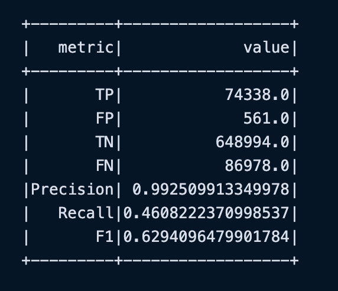

# Flight Delay Prediction at Scale with Apache Spark ML

## Description
Predict whether a flight will arrive late based on the following features: Day of the month, day of the week, carrier, origin airport ID, destination airport ID, departure delay.
 
Built with Spark ML and PySpark, prediction is achieved on a large dataset efficiently.
